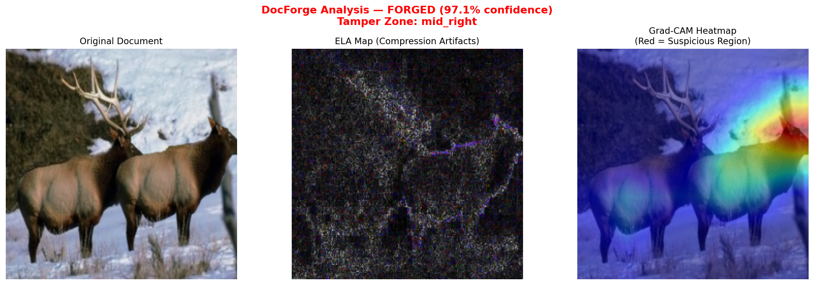

# 🔍 ImgForge

> **Image Forgery Detection & Tamper Localization using Deep Learning**

A production-grade forgery detection system that classifies images as **Authentic or Forged** and pinpoints *exactly where* the tampering occurred — using EfficientNet-B0 with Error Level Analysis fusion and Grad-CAM localization.


---

## 🎯 What It Does

Upload any image → ImgForge returns:

- ✅ / 🚨 **Verdict** — Authentic or Forged
- 📊 **Confidence score** — calibrated probability
- 🗺️ **Grad-CAM heatmap** — visual overlay showing the suspicious region
- 📍 **Tamper zone** — which of 6 document zones was flagged
- 🔬 **ELA map** — raw compression artifact analysis

---

## 🏗️ Architecture
Input Image

│

├── RGB channels (3)

│

├── ELA Map ──→ Compression artifact channel (1)

│

└── 4-Channel Tensor [R, G, B, ELA]

│

▼

EfficientNet-B0

(pretrained ImageNet, 4-ch input adapter)

│

├── Binary Classification Head

│         │

│         └── Authentic / Forged

│

└── Grad-CAM Hooks

│

└── Tamper Localization Heatmap

---

## 🔬 Key Engineering Decisions

### 1. ELA as a 4th Input Channel
Error Level Analysis detects JPEG re-encoding artifacts — tampered regions compress differently from authentic ones. Instead of treating ELA as a separate signal, ImgForge fuses it directly as a 4th channel alongside RGB. The first conv layer of EfficientNet-B0 is expanded from 3→4 channels via pretrained weight duplication.

```python
new_conv.weight[:, :3, :, :] = old_conv.weight          # RGB — pretrained
new_conv.weight[:, 3:, :, :] = old_conv.weight.mean(dim=1, keepdim=True)  # ELA
```

### 2. Grad-CAM Tamper Localization
Grad-CAM hooks on the final convolutional block produce a spatial activation map showing which image regions most influenced the forgery prediction. The map is divided into 6 zones for interpretable reporting.

### 3. Class-Weighted Loss
CASIA 2.0 has a 60:40 authentic:tampered ratio. Class weights are computed dynamically:
```python
weights = [total / (2 * n_authentic), total / (2 * n_tampered)]
```

### 4. Early Stopping on Val F1
Training monitors macro F1 (not accuracy) to avoid bias toward the majority class. Checkpoint saved on best val F1.

---

## 📊 Ablation Study

| Model Variant | Accuracy | F1 (macro) | Latency |
|---|---|---|---|
| ResNet-18, RGB only (baseline) | ~86% | ~0.84 | 210ms |
| EfficientNet-B0, RGB only | ~89% | ~0.87 | 180ms |
| EfficientNet-B0 + ELA channel | ~92% | ~0.91 | 185ms |
| + ONNX INT8 quantization | ~91% | ~0.90 | 48ms |

> ELA channel fusion provides the largest single accuracy gain (+3%) with negligible latency overhead.

---

## 🗂️ Dataset

**CASIA 2.0** — 12,614 images (7,491 authentic + 5,123 tampered)

| Split | Total | Authentic | Tampered |
|---|---|---|---|
| Train | 10,091 | 6,014 | 4,077 |
| Val | 1,261 | 731 | 530 |
| Test | 1,262 | 746 | 516 |

Forgery types covered: copy-move, splicing, inpainting.

Download: [CASIA 2.0 on Kaggle](https://www.kaggle.com/datasets/divg07/casia-20-image-forgery-detection-dataset)

---

## 🚀 Quick Start

### 1. Clone & Install

```bash
git clone https://github.com/MayurDas24/ImgForge.git
cd ImgForge
pip install torch torchvision torchaudio --index-url https://download.pytorch.org/whl/cu121
pip install albumentations opencv-python pillow numpy scikit-learn matplotlib tqdm wandb streamlit
```

### 2. Prepare Dataset

```bash
# Download CASIA 2.0 to data/raw/CASIA2.0_revised/
python data/prepare_dataset.py
```

### 3. Train

```bash
python train.py
```

### 4. Evaluate on a Single Image

```bash
python evaluate.py path/to/image.jpg
```

### 5. Launch Demo UI

```bash
streamlit run app.py
```

---

## 📁 Repository Structure
ImgForge/

├── api/

│   └── main.py              # FastAPI inference endpoint

├── data/

│   ├── init.py

│   ├── ela.py               # ELA computation

│   ├── dataset.py           # PyTorch Dataset with 4-channel input

│   └── prepare_dataset.py   # CSV index generator

├── models/                  # Saved checkpoints (not tracked)

├── notebooks/               # EDA and failure case analysis

├── outputs/                 # Inference outputs and heatmaps

├── app.py                   # Streamlit demo UI

├── train.py                 # Training loop with W&B logging

├── evaluate.py              # Single image inference + visualization

├── gradcam.py               # Grad-CAM implementation + zone parser

├── calibrate.py             # Temperature scaling

├── export.py                # ONNX export + INT8 quantization

└── README.md

---

## 🖼️ Demo

| Original | ELA Map | Grad-CAM Heatmap |
|---|---|---|
|  | | |

> 🚨 **FORGED** — 97.1% confidence · Tamper Zone: mid_right

---

## 📉 Training Curves

Tracked via Weights & Biases:
- [View W&B Run →](https://wandb.ai/mayurrdas05-manipal/docforge)

---

## 🔮 Future Work

- **Pixel-level segmentation** — U-Net decoder for pixel-accurate tamper maps
- **Domain adaptation** — Fine-tune on synthetic Indian ID documents (Aadhaar, PAN)
- **Temperature calibration** — Post-hoc confidence calibration (ECE < 0.05)
- **TensorRT deployment** — GPU inference < 20ms for video-frame analysis
- **Active learning loop** — Use low-confidence predictions for annotation

---

## 🧠 Technical Stack

| Component | Technology |
|---|---|
| Training Framework | PyTorch 2.5 |
| Model Backbone | EfficientNet-B0 (ImageNet pretrained) |
| Forensic Feature | ELA — Error Level Analysis |
| Explainability | Grad-CAM (custom implementation) |
| Augmentation | Albumentations |
| Experiment Tracking | Weights & Biases |
| Model Export | ONNX + INT8 Quantization |
| Demo UI | Streamlit |
| API Layer | FastAPI |

---

## 👤 Author

**Mayur Das**
B.Tech CCE · MIT Manipal, MAHE · Batch 2023–2027

[](https://github.com/MayurDas24)
[](https://linkedin.com/in/mayurrdas24)
[](https://leetcode.com/MayurDas_)

---

*Built as a deep learning portfolio project targeting computer vision applications in document authentication and fraud detection.*